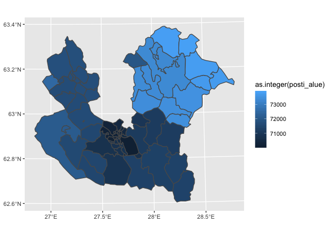

Example project for building maps by R interface

- Basic maps <[map_graphs.R](map_graphs.R)>
- Leaflet interactive map of Kuopio <[interactive_kuopio.R](interactive_kuopio.R)>
- Leaflet interactive map of selected municipality <[interactive_municipality.R](interactive_municipality.R)>
- Leaflet interactive map of Finland <[interactive_finland.R](interactive_finland.R)>
- Leaflet memo <[leaflet.R](leaflet.R)>

## Useful links

* geofi R Package <https://github.com/rOpenGov/geofi>
* Leaflet for R <https://rstudio.github.io/leaflet/>
* PXWeb API interface for R <https://cran.r-project.org/web/packages/pxweb/vignettes/pxweb.html>
* PXWeb API HELP <https://www.stat.fi/static/media/uploads/org_en/avoindata/px-web_api-help.pdf>


```r
library(geofi)
library(ggplot2)
municipalities <- get_municipalities(year = 2019, scale = 4500)
## [ows4R][INFO] OWSGetCapabilities - Fetching http://geo.stat.fi/geoserver/wfs?service=WFS&version=1.0.0&request=GetCapabilities 
## [ows4R][INFO] WFSGetFeature - Fetching http://geo.stat.fi/geoserver/wfs?service=WFS&version=1.0.0&typeName=tilastointialueet:kunta4500k_2019&logger=INFO&request=GetFeature 
## [ows4R][INFO] WFSDescribeFeatureType - Fetching http://geo.stat.fi/geoserver/wfs?service=WFS&version=1.0.0&typeName=tilastointialueet:kunta4500k_2019&request=DescribeFeatureType
ggplot(municipalities) + 
  geom_sf(aes(fill = as.integer(kunta))) +
  theme(legend.position = "none")
```

<!-- -->

