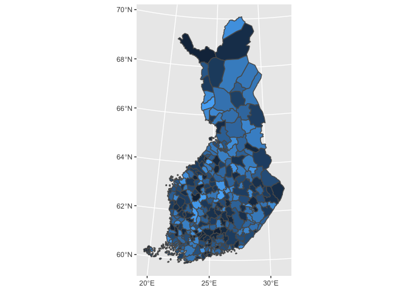

Example project for building maps by R interface

- Basic maps <map_graphs.R>
- Leaflet interactive map of Kuopio <interactive_kuopio.R>
- Leaflet interactive map of selected municipality <interactive_municipality.R>
- Leaflet interactive map of Finland <interactive_finland.R>
- Leaflet memo <leafler.R>

## Useful links

* geofi R Package <https://github.com/rOpenGov/geofi>
* Leaflet for R <https://rstudio.github.io/leaflet/>
* PXWeb API interface for R <https://cran.r-project.org/web/packages/pxweb/vignettes/pxweb.html>
* PXWeb API HELP <https://www.stat.fi/static/media/uploads/org_en/avoindata/px-web_api-help.pdf>

<!-- -->

